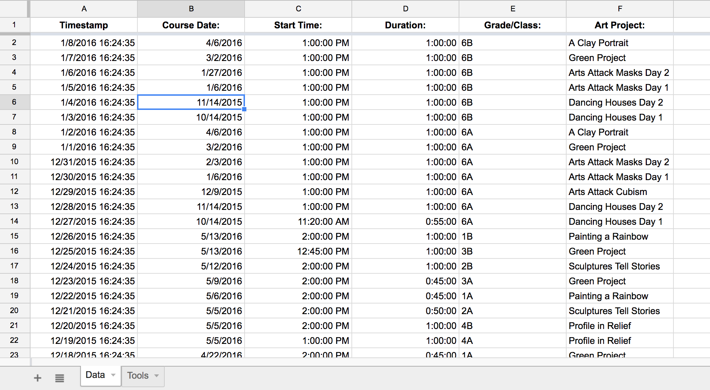
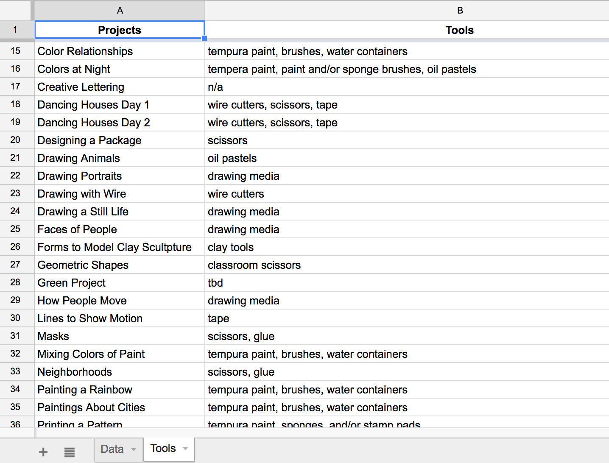
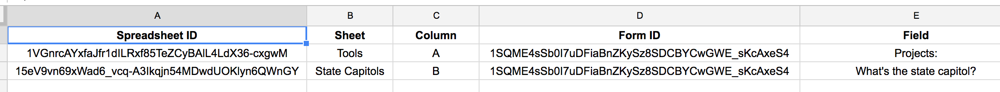
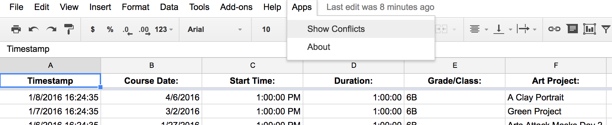
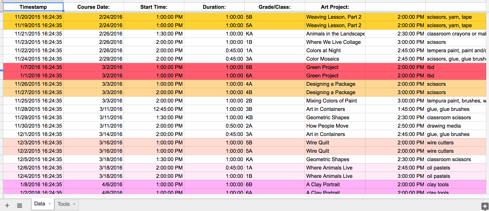
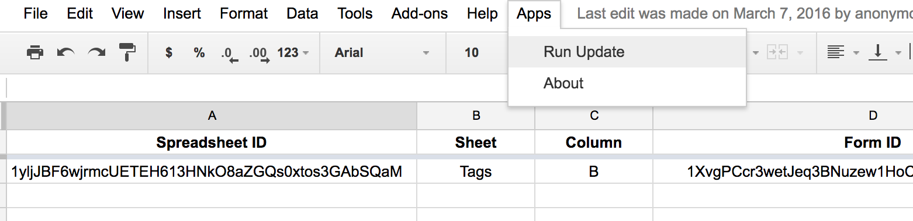

# Art Enrichment

Two custom Google Sheet menu functions. Built as a Google App Script.

> I built this project in 2015 and back then, my build and deployment step was
> overly complex then concluded with a cut-and-paste step. Since I recently
> discovered @google/clasp, I consolidated the original code, and employed
> webpack to bundle and clasp to deploy.
>
> For nostalgia, I've included the original code in the `/legacy` folder.

## Project Overview

The Art Enrichment(AE) program at a local private elementary school offers art
courses for each grade (K-8) throughout the school year. Prior to the start of
the school year, AE teachers submit their course schedule to the AE chairperson,
who is tasked to identify and correct scheduling conflicts.

### Requirements

1. Provides a consistent interface to control the quality of course schedule
   data submitted to the AE chairperson.
2. Provide a repository to capture and store submitted schedules.
3. Automate the process of identifying and reporting schedule conflicts.

### Conflict Rules

A scheduled art course has three data points - the date scheduled, the time
scheduled and the art equipment required.

> Art equipment is shared among all staff.

Schedule conflicts exist when **all** the following criteria are met.

- 1+ courses occur on the same course date.
- 1+ courses are offered at overlapping times.
- 1+ courses have at least one tool in common.

### Solutions

To solve the first requirement, I created a Google Form. The AE chairperson
sends the form to all AE teachers, who complete and submit.

Submitted forms are captured in a Google Sheet - thus, solving the second
requirement.

To solve the third requirement, I wrote a Google App Script called 'Show
Conflicts'. It is bound to the Google Sheet that stores all submitted forms. The
script adds a custom menu option for the AE chairperson to easily run the
conflict reporting program.

## Technical Overview

The Google Sheet that stores form responses, holds 3 worksheets - listed below
by name.

1. Data
1. Tools
1. Configuration

### Data Worksheet

This is the _default_ worksheet and must be named **Data**. It is the
destination for all schedule form responses and has the following columns.

- Timestamp
- Course Date
- Start Time
- Duration
- Class
- Art Project
- End Time _(computed)_
- Tools _(computed)_

All fields are **required**.

### Tools Worksheet

Before the school year starts, the AE chairperson designs all art projects to be
taught for the year. Each art project requires a lists of art supplies - or
_tools_. This worksheet must be named **Tools** and has the following columns.

- Projects
- Tools

The **Projects** column is the master list of all art projects for the year. The
projects in this column are programmatically added to the _Art Project_
drop-down field on the schedule form.

The values in the **Tools** column are comma separated values that list the art
equipment required for the cooresponding project.

### Configuration Worksheet

The second menu function is Update Projects. It allows the AE coordinator to
add and remove projects from the **Projects** column on the **Tools** worksheet
and then easily sync the project list to the _Art Project_ field choices on the
schedule form.

The Update Projects program uses the **Configuration** worksheet to complete its
work. The worksheet has the following columns.

- Spreadsheet ID
- Sheet
- Columns
- Form ID
- Field

#### Spreadsheet ID

The ID of the spreadsheet that holds the worksheet with the list of projects.

#### Sheet

The name of the worksheet in the spreadsheet mentioned above.

#### Column

The column **letter** of the column in the worksheet above that holds the list
of projects.

> The program assumes this worksheet has a header row, so the program will pull
> column values starting at row 2.

#### Form ID

The ID of the target form in this column.

#### Field

The field to update.

> Google calls the field name, _Question Title_. Put the complete value of the
> _Question Title_, including spaces and punctuation, in this column.

## Show Conflict

From the menu, select `Apps -> Show Conflicts`.

### Conflict Report

Rows with the same highlight color are in conflict.

## Update Projects

From the menu, select `Apps -> Run Update`.

## Author

- [David Valles](https://dtjv.io)

## License

[MIT License](LICENSE)
